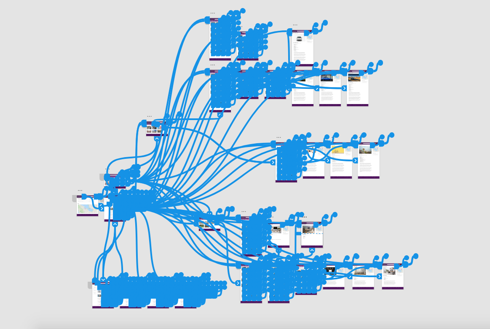
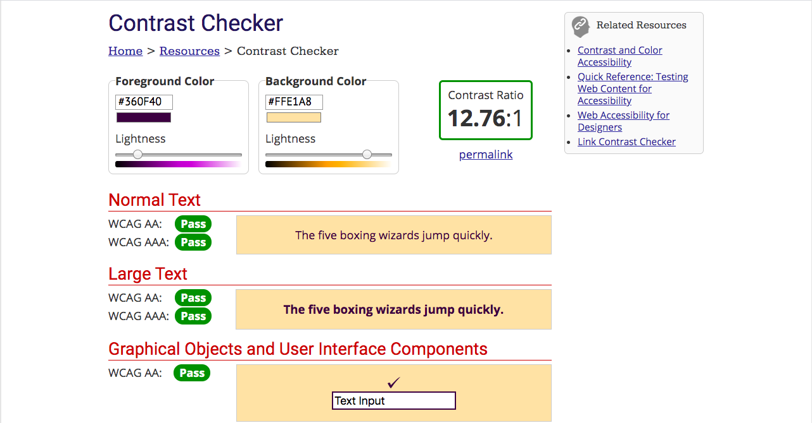
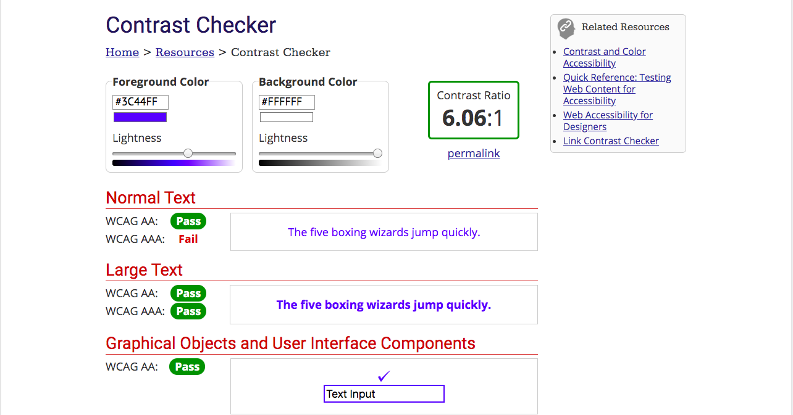
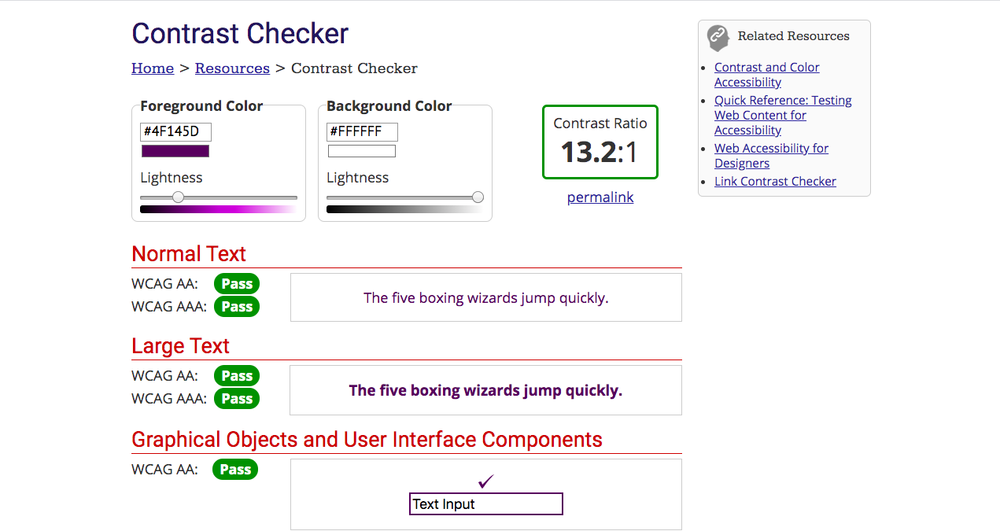

# DH150-Assignment7
## Description and Purpose:
This project is based off of the site ‘Craigslist’. Craigslist is a website that functions as an online marketplace and community that allows users to buy and/or sell items, discuss on forums, find housing, and explore jobs. However, Craigslist is mainly known and used for their online marketplace, specifically, buying and selling items. This project will focus on the searching aspect when buying items on the website. The prototyped site will demonstrate improvements in the overall interface design, the ability to quickly find information, and safety features when looking at posts. 
 
 
 
 

## Screen Designs

## Process of the prototyping phase:

The initial step in the prototyping phase was to recreate the entire look of the site. The previous site was cluttered with words and was difficult to navigate through. However, it was important to retain features of the previous site in order for long time users to intuitively use and accept the new site. The next steps were to re categorize all  the sections and create smaller categories. Then, the categories were paired with images to help the user more easily identify the groups. Afterwards, the postings page of the site was refined and simplified, and there is an added function “Craigslist’s Picks’ to help prevent scams and dangerous situations. Finally, the item’s post page was simplified to make the information, specifically, the contact information of the seller. 

## List of tasks the interactive prototype supports:

  * Going back to the home page
  
  * Searching through categories on the home/main page
  
  * Filtering posts 
  
  * Using ‘Craigslist’s Picks’ Function
  
  * Change location page
  
  * Scrolling through options on home page
  
  * Looking at posts
  
  * Favoriting the posts

## Graphical Interface Design

In this prototype, the graphical interface was heavily altered from that original site in order to create easier navigation through the site. The categories of the site were condensed into larger groups and were replaced with images. The images will allow the users to more easily recognize the different categories on the front page, rather than a jumble of words. This decision was a result of researching through numerous sites, such as amazon, facebook, and ebay. These popular sites mainly used images to help users quickly recognize the products they are selling. 
 
 
The color scheme of this prototype was based off of the craigslist logo. Their logo cannot be found within the site, so to continue that tradition I did not use the logo. However, I used the color of the logo to design the site. The site mainly uses different shades of purple, white, and grey. There is high contrast between the dark purple and the white lettering to help those who have color blindness. Additionally, there are pops of orange, which highly contrasts with purple, to emphasize specific buttons. Finally, the blue lettering of the posts and the post style are retained from the previous site to provide long time users a sense of familiarity. 

## Wireflow

## Impression Test

### Inclass Impression Test

[Click Here for Link](https://docs.google.com/document/d/1VOD8QfmIM2QyXMfvkLEhRjMFw4JLVMov3yZIh_D0NpE/edit?usp=sharing)

### Impression Test #2

[Click Here for Link](https://drive.google.com/file/d/1yNGnfigWb7HAaQaUJHIDJQIMg69zH8jL/view?usp=sharing)

**Findings:**

The tester mentioned that visually the prototype of the new Craigslist site was easy to digest and understand. However, the tester mentioned that the site was difficult to use due to the limited amount of clickables within the site the moment. The tester expected that more buttons or images were able to be clicked, so they were confused when the button did not lead to a different page. The solution to his issue would be to create other pages for those buttons. Another issue was that the posts did not necessarily correspond with the title of the post. This caused the tester to be slightly confused and distracted when the listing title of the car and the image of the car did not correspond. This would be resolved by making the postings more legit and making the filters actually filter the posts.

## Accessibility: Color Contrast Check

## Interactive Prototype

https://xd.adobe.com/view/65c01a42-19a9-414c-55ef-66b362ae7e15-13f1/

## Cognitive Walkthroughs

Persona 1:

Henry is a 4th year undergraduate student at University of California, Los Angeles studying business. He just got a new higher paying job that is slightly further away and needs a car to get to his new workplace. He would take the bus, but since it is further away than his previous job, it will take double the amount of time to get there due to the constant stops. Getting a car will allow him to save more time and give him more flexibility to travel around Los Angeles.

[Video](https://drive.google.com/file/d/1IC0xsF6hYaICpFat6F2LQ1fHJC9g2o3a/view?usp=sharing)

Persona 2:

Jennifer is currently living in an apartment with two other roommates, but she intends to move into a new house with her recently wedded husband. She is currently saving up money for that venture, but she just broke her desk from attempting to stand on it to change a lightbulb on the ceiling. Since she is moving soon, she needs a temporary replacement until the lease is up at her current apartment and she moves to a new house. She is picky and prefers to buy new and aesthetic items, but she realizes that she is moving out soon and will need a new desk for the house. So, the most logical plan for Jennifer is to buy a cheap temporary replacement that still looks aesthetic. She decides to go onto an online marketplace to find a desk she likes for a much cheaper price than retail prices.

[Video](https://drive.google.com/file/d/1IB760XfCGECo_CDkqvmftJt2at3jKgeO/view?usp=sharing)

Persona 3:

Daphne is currently working extra shifts and hours to save up money to move to a nicer neighborhood with her son. She wants to be able to provide her son with anything she can to give him a proper childhood even with a constantly working single mother. Daphne is trying to let her son learn and experience what other kids his age experience. So, she wants her son to learn how to ride a bike, so she would like to buy a bike for her six year old son. She knows that there is a decent amount of thievery in her neighborhood, so she prefers to purchase a used bike for now and buy a better bike when they move neighborhoods. Daphne is extremely terrible and slow with technology since she rarely uses her very out of date phone and laptop.

[Video](https://drive.google.com/file/d/12loOvl8N5YVZxIFDIecTXhBFAwZ4FywS/view?usp=sharing)

**Findings:**

When doing the cognitive walkthrough, the site functioned properly and all three personas were able to find a post that they were interested in purchasing. However, throughout the walkthrough, there are many clickable buttons, pages, and images, but majority of these were not linked to anything due to this being a prototype. As a result, this was not completely able to simulate how users search around to look for different posts. Another finding was that the site was more difficult to navigate through since all the clickables could not be clicked, causing slight confusion. Additionally, the search bar is not supported by this version of the prototype, therefore, the users may have clicked through the site in an unfamiliar way. Finally, when using the filters, they do not stay checked after updating. This can cause some confusion to the users, causing them to think that the posts were not filtered. 

## Reflection

The process of creating a website from scratch was very difficult. The time that it took to create a functioning prototype website took much longer than I had expected. The interface was not super difficult to use, however, when different lays began to stack and hover options were added for each pressable button, things became much more confusing. Additionally, when creating ‘animated’ or popups for the screen, it was much more difficult than I thought because every step had to be a new page. Then these pages were connected to create an animated look. However, I was not too happy with the result of these animated buttons. The animation was not as smooth as I would have liked it to be. 
 
 
Although the testing did not mention much about the overall design of the site, I would like to further improve the look of the site and improve the interface. I would like to further look into colors and accessibility to create a more vibrant site. Additionally, it would help if the prototype had more functions that the user could click through rather than the specified directions that only fulfilled my three persona’s difficulties. This was a slight issue in the impression test, the tester was slightly frustrated due to most of the clickables being unclickable. There were several other small issues, such as the filtering not actually filtering and unrealistic post listings, which would be solved through creating the actual site with programming or creating more pages with more realistic content within the prototype software. 

